# react-sample-projects

The goal of this project is to provide a set of simple samples, providing and step by step guide to start working with React.

## Found this project useful?

If you found this project useful, then please consider giving it a ⭐️ on Github and sharing it with your friends via social media.

## Demo

### Level 1

| #   | Name               | Preview                                                                                                                                                                                             | Source                                     |
| --- | ------------------ | --------------------------------------------------------------------------------------------------------------------------------------------------------------------------------------------------- | ------------------------------------------ |
| 1   | Color Flipper      |                 | [Color Flipper](./color-flipper)           |
| 2   | Counter            | <a href="https://curioustushar.github.io/react-sample-projects/counter"> 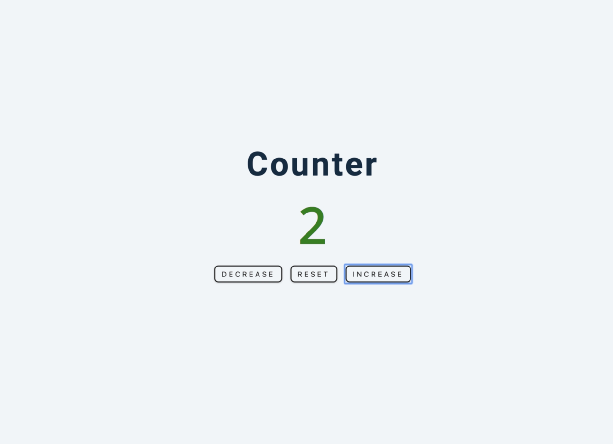 </a>                                  | [Counter](./counter)                       |
| 3   | Reviews            | <a href="https://curioustushar.github.io/react-sample-projects/reviews"> 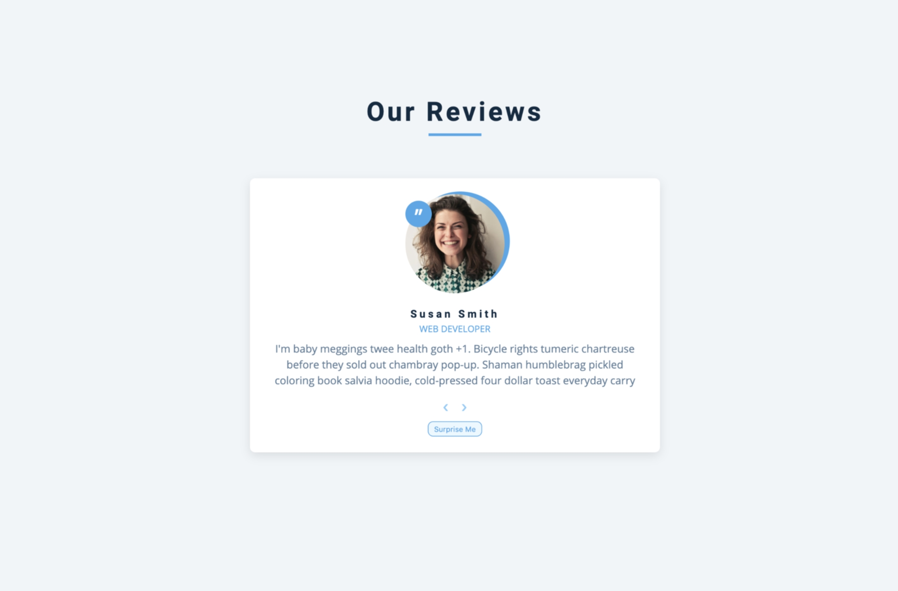 </a>                                  | [Reviews](./reviews)                       |
| 4   | Navbar             |                                      | [Navbar](./navbar)                         |
| 5   | Sidebar            | <a href="https://curioustushar.github.io/react-sample-projects/sidebar"> 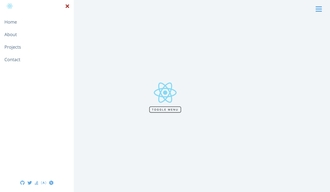 </a>                                  | [Sidebar](./sidebar)                       |
| 6   | Modal              | <a href="https://curioustushar.github.io/react-sample-projects/modal"> 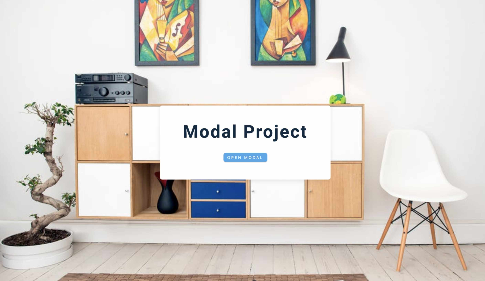 </a>                                        | [Modal](./modal)                           |
| 7   | Questions          | <a href="https://curioustushar.github.io/react-sample-projects/questions"> 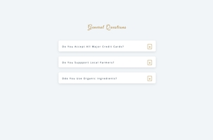 </a>                            | [Questions](./questions)                   |
| 8   | Menu               |                                            | [Menu](./menu)                             |
| 9   | Video              | <a href="https://curioustushar.github.io/react-sample-projects/video"> 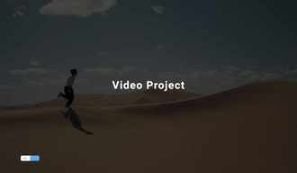</a>                                        | [Video](./video)                           |
| 10  | Scroll             | <a href="https://curioustushar.github.io/react-sample-projects/scroll"> 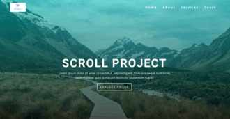</a>                                     | [Scroll](./scroll)                         |
| 11  | Tabs               | <a href="https://curioustushar.github.io/react-sample-projects/tabs"> 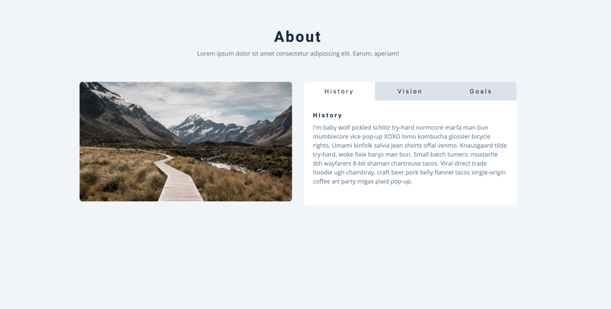</a>                                           | [Tabs](./tabs)                             |
| 12  | Countdown Timer    |           | [Countdown Timer](./countdown-timer)       |
| 13  | Lorem ipsum        | <a href="https://curioustushar.github.io/react-sample-projects/lorem-ipsum"> 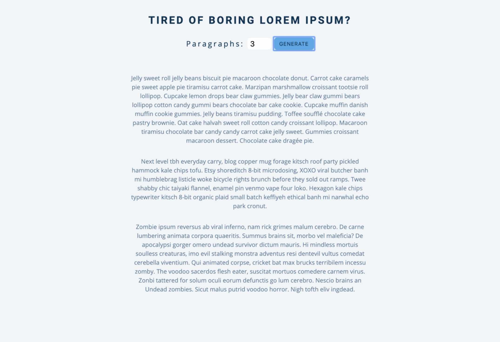</a>                            | [Lorem Ipsum](./lorem-ipsum)               |
| 14  | Todo               | <a href="https://curioustushar.github.io/react-sample-projects/todo"> 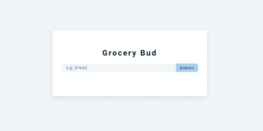</a>                                           | [Todo](./todo)                             |
| 15  | Slider             | <a href="https://curioustushar.github.io/react-sample-projects/slider"> 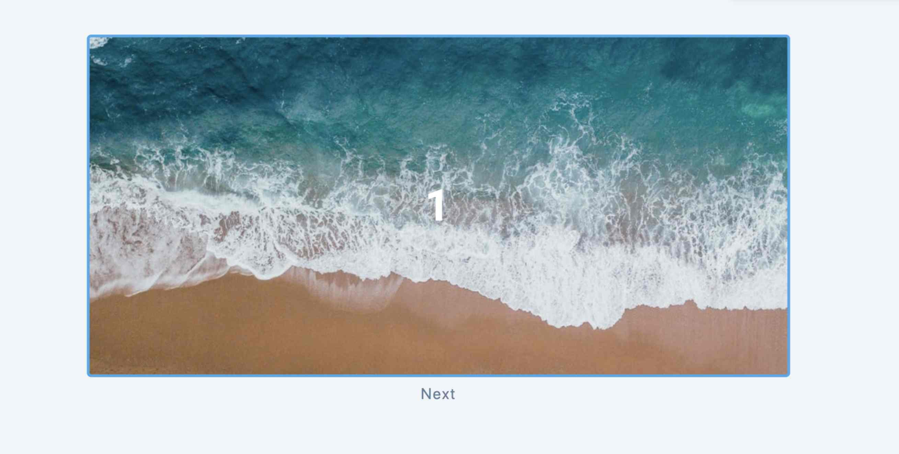</a>                                     | [Slider](./slider)                         |
| 16  | Image Slider       |                    | [Image Slider](./image-slider)             |
| 17  | Analog Clock       | <a href="https://curioustushar.github.io/react-sample-projects/analog-clock"> 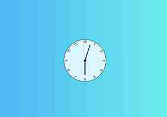</a>                   | [Analog Clock](./analog-clock)             |
| 18  | Relaxer            |                                   | [Relaxer](./relaxer)                       |
| 19  | Sortable List      | <a href="https://curioustushar.github.io/react-sample-projects/sortable-list"> 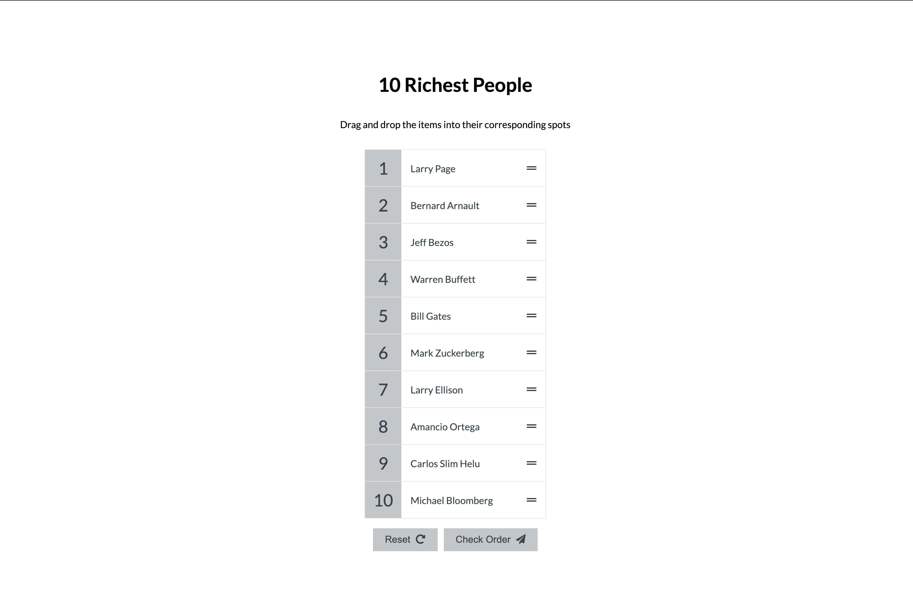</a>                          | [Sortable List](./sortable-list)           |
| 20  | Digital Clock      | <a href="https://curioustushar.github.io/react-sample-projects/digital-clock"> 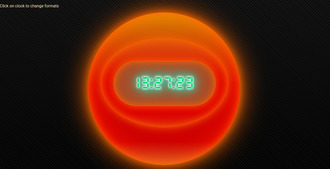</a>                     | [Digital Clock](./digital-clock)           |
| 21  | Grandma's Sweets   | <a href="https://curioustushar.github.io/react-sample-projects/grandma-sweets"> 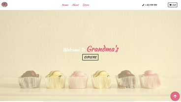</a>             | [Grandma's Sweets](./grandma-sweets)       |
| 22  | Movie Seat Booking | <a href="https://curioustushar.github.io/react-sample-projects/movie-seat-booking"> 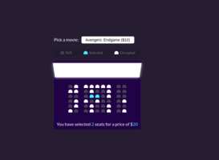</a> | [Movie Seat Booking](./movie-seat-booking) |
| 23  | Expense Tracker    | <a href="https://curioustushar.github.io/react-sample-projects/expense-tracker"> 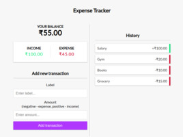</a>          | [Expense Tracker](./expense-tracker)       |
| 24  | Breakout Game      |                 | [Breakout Game](./breakout-game)           |
| 25  | Hulu Clone         |                          | [Hulu Clone](./hulu-clone)                 |

### Level 2

| #   | Name          | Preview                                                                                                                                                                              | Source                           | Plugins used                                 |
| --- | ------------- | ------------------------------------------------------------------------------------------------------------------------------------------------------------------------------------ | -------------------------------- | -------------------------------------------- |
| 1   | Music Player  | <a href="https://curioustushar.github.io/react-sample-projects/music-player"> 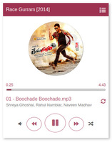</a>    | [Music Player](./music-player)   |                                              |
| 2   | Leaflet Demos | <a href="https://curioustushar.github.io/react-sample-projects/leaflet-demos"> 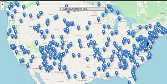</a> | [Leaflet Demos](./leaflet-demos) | `leaflet`                                    |
| 3   | Pokemon       | <a href="https://curioustushar.github.io/react-sample-projects/pokemon"> 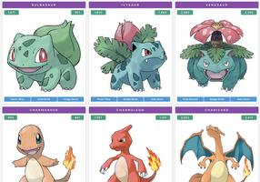</a>               | [Pokemon](./pokemon)             | `redux`, `graphql`, `apollo`                 |
| 4   | Demo Cart     | <a href="https://curioustushar.github.io/react-sample-projects/demo-cart"> 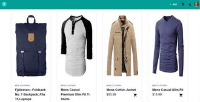</a>             | [Demo cart](./demo-cart)         | `redux`, `redux-thunk` `chakra-ui`, `formik` |

## TODO

- \[ ] Improve Testing
- \[ ] Form Validator
- \[x] Sortable List | Drag & Drop API
- \[x] Digital Clock
- \[x] Breakout Game | Canvas & Local Storage

## Contributing

Awesome! Contributions of all kinds are greatly appreciated. To help smoothen the process we have a few non-exhaustive guidelines to follow which should get you going in no time.

## Using GitHub Issues

1. Feel free to use GitHub [issues](https://github.com/curioustushar/react-sample-projects/issues) for questions, bug reports, and feature requests
2. Use the search feature to check for an existing issue Include as much information as possible and provide any relevant resources (Eg. screenshots)

## Created & Maintained By

<table>
  <tr>
    <td align="center"><a href="https://curioustushar.github.io/">
         
        <b>Tushar Gupta</b></a> 
        <a href="#" title="Code">💻 </a>
        <a href="#" title="Documentation">📖</a>
        <a href="#" title="Ideas">🤔</a>
        <a href="#" title="Answering Questions">💬 </a>
        <a href="#" title="Reviewed Pull Requests">👀</a>
        <a href="#" title="Maintenance">🚧 </a>
    </td>
    <td align="center"><a href="http://nmanikiran.com">
         
        <b>Mani Kiran N</b></a> 
        <a href="#" title="Code">💻 </a>
        <a href="#" title="Documentation">📖</a>
        <a href="#" title="Ideas">🤔</a>
        <a href="#" title="Maintenance">🚧 </a>
    </td>
  </tr>
</table>

Feel free to reach out to me through [@curioustushar](https://twitter.com/curioustushar) if you have any questions or feedback! 😊

## Thanks & Credits

Idea / Concepts is take from

- [javascript-basic-projects](https://github.com/john-smilga/javascript-basic-projects).
- [vanillawebprojects](https://github.com/bradtraversy/vanillawebprojects).
