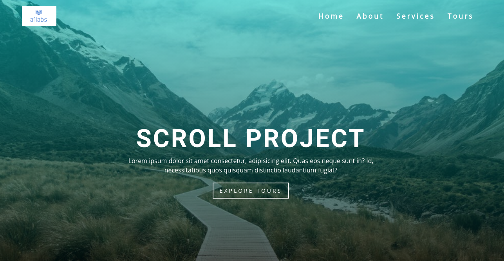
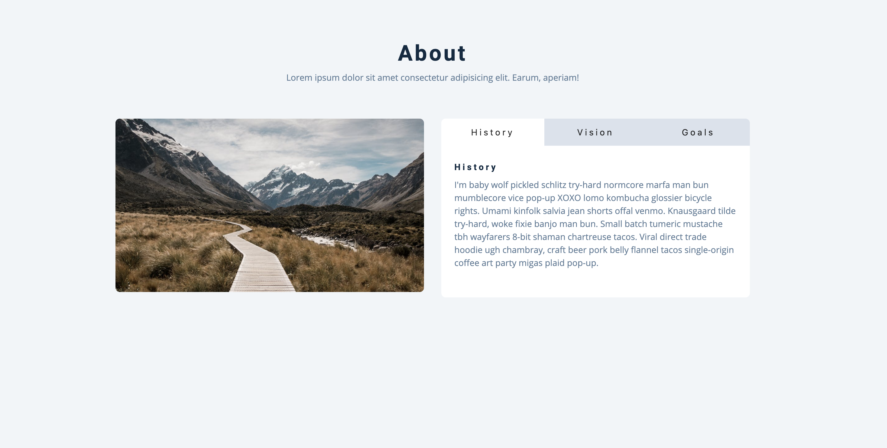
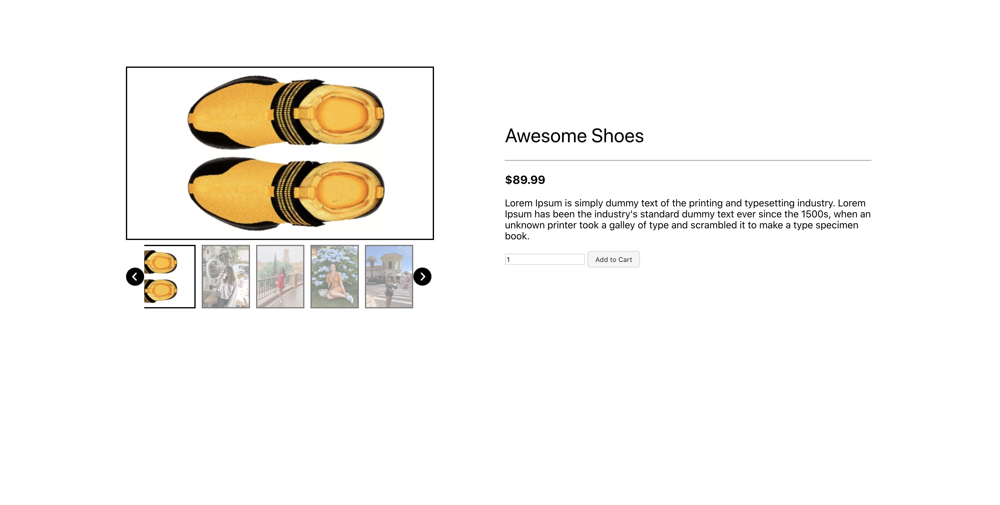
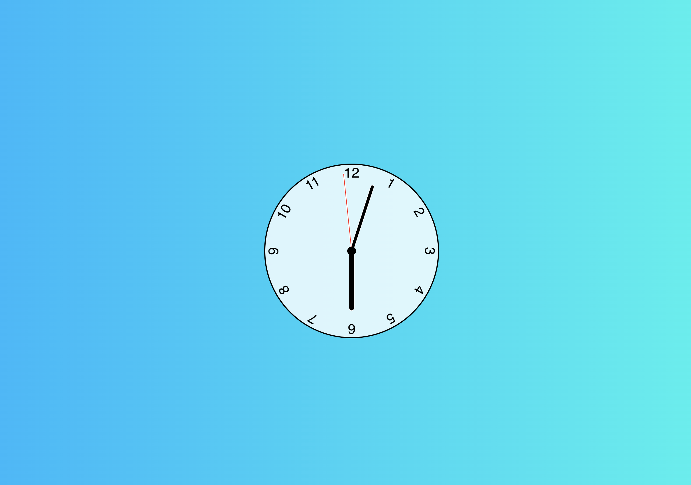

# react-sample-projects

React Sample Projects

## Found this project useful?

If you found this project useful, then please consider giving it a ⭐️ on Github and sharing it with your friends via social media.

## Demo

| Name            | Preview                                                                            | Source                               |
| --------------- | ---------------------------------------------------------------------------------- | ------------------------------------ |
| Color Flipper   |  | [Color Flipper](./color-flipper)     |
| Counter         |              | [Counter](./counter)                 |
| Reviews         |              | [Reviews](./reviews)                 |
| Navbar          |                | [Navbar](./navbar)                   |
| Sidebar         |              | [Sidebar](./sidebar)                 |
| Modal           |                  | [Modal](./modal)                     |
| Questions       |          | [Questions](./questions)             |
| Menu            |                    | [Menu](./menu)                       |
| Video           |                  | [Video](./video)                     |
| Scroll           |                  | [Scroll](./scroll)                     |
| Tabs           |                  | [Tabs](./tabs)                     |
| Countdown Timer |        | [Countdown Timer](./countdown-timer) |
| Lorem ipsum     |            | [Lorem Ipsum](./lorem-ipsum)         |
| Todo     |            | [Todo](./todo)         |
| Slider          |                | [Slider](./slider)                   |
| Image Slider    |    | [Image Slider](./image-slider)       |
| Analog Clock    |    | [Analog Clock](./analog-clock)       |

## TODO

- \[ ] Improve Docs
- \[ ] Improve Testing
- \[ ] Form Validator
- \[ ] Movie Seat Booking | DOM & Local Storage
- \[ ] Relaxer App | CSS Animations
- \[ ] Exchange Rate Calculator
- \[ ] Sortable List | Drag & Drop API

## Contributing

Awesome! Contributions of all kinds are greatly appreciated. To help smoothen the process we have a few non-exhaustive guidelines to follow which should get you going in no time.

## Using GitHub Issues

1. Feel free to use GitHub [issues](https://github.com/curioustushar/react-sample-projects/issues) for questions, bug reports, and feature requests
2. Use the search feature to check for an existing issue Include as much information as possible and provide any relevant resources (Eg. screenshots)

## Created & Maintained By

<table>
  <tr>
    <td align="center"><a href="https://curioustushar.github.io/">
         
        <b>Tushar Gupta</b></a> 
        <a href="#" title="Code">💻 </a>
        <a href="#" title="Documentation">📖</a>
        <a href="#" title="Ideas">🤔</a>
        <a href="#" title="Answering Questions">💬 </a>
        <a href="#" title="Reviewed Pull Requests">👀</a>
        <a href="#" title="Maintenance">🚧 </a>
    </td>
    <td align="center"><a href="http://nmanikiran.com">
         
        <b>Mani Kiran N</b></a> 
        <a href="#" title="Code">💻 </a>
        <a href="#" title="Documentation">📖</a>
        <a href="#" title="Ideas">🤔</a>  
        <a href="#" title="Maintenance">🚧 </a>
    </td>
  </tr>
</table>

Feel free to reach out to me through [@curioustushar](https://twitter.com/curioustushar) if you have any questions or feedback! 😊

## Thanks & Credits

Idea / Concepts is take from [javascript-basic-projects](https://github.com/john-smilga/javascript-basic-projects).
