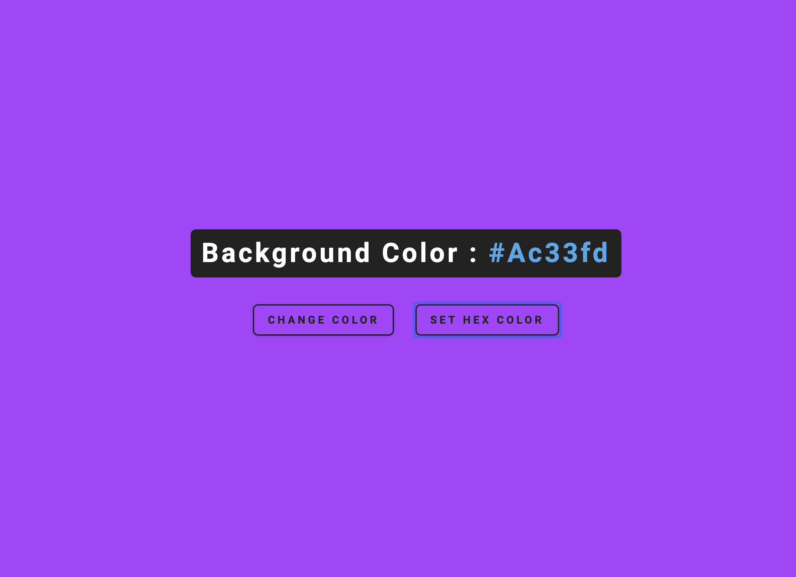
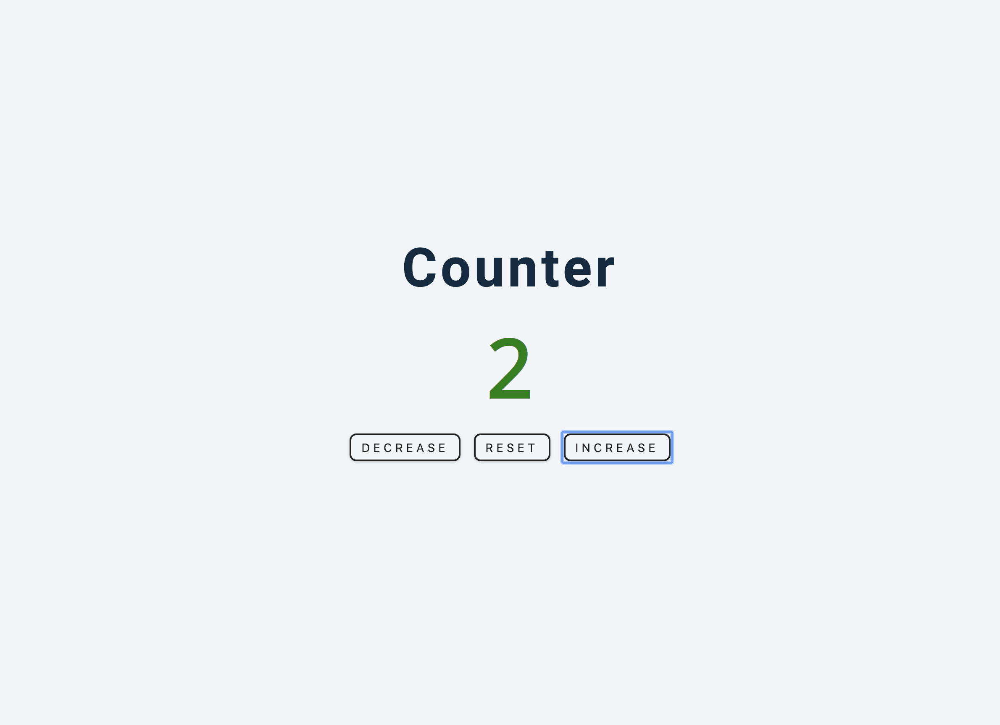
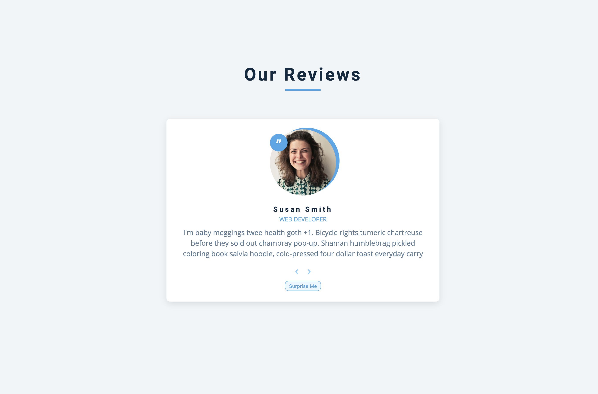
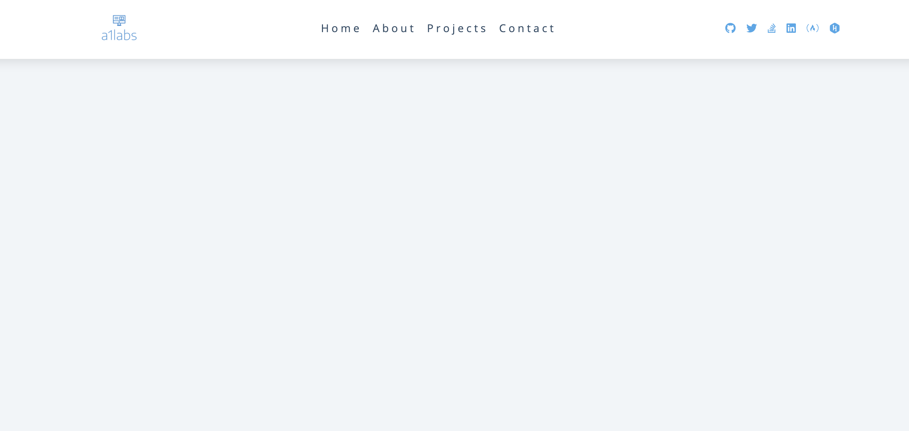
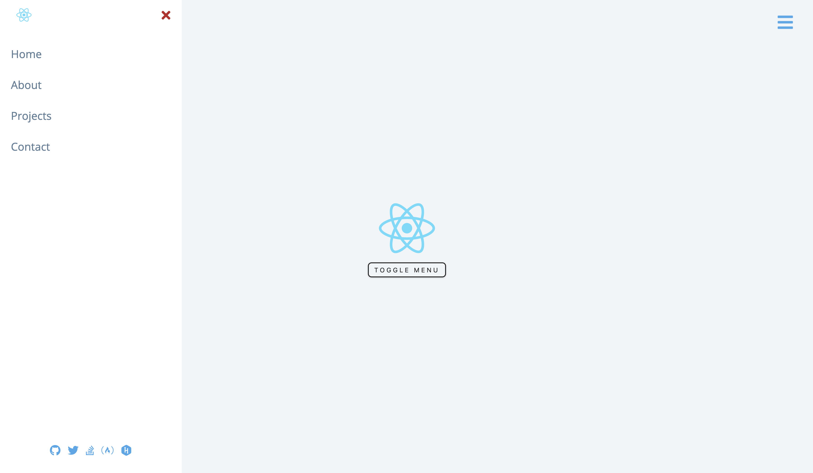
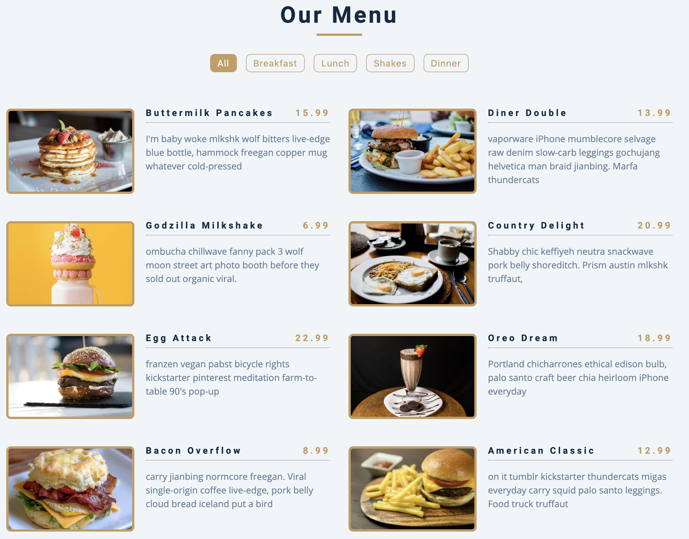
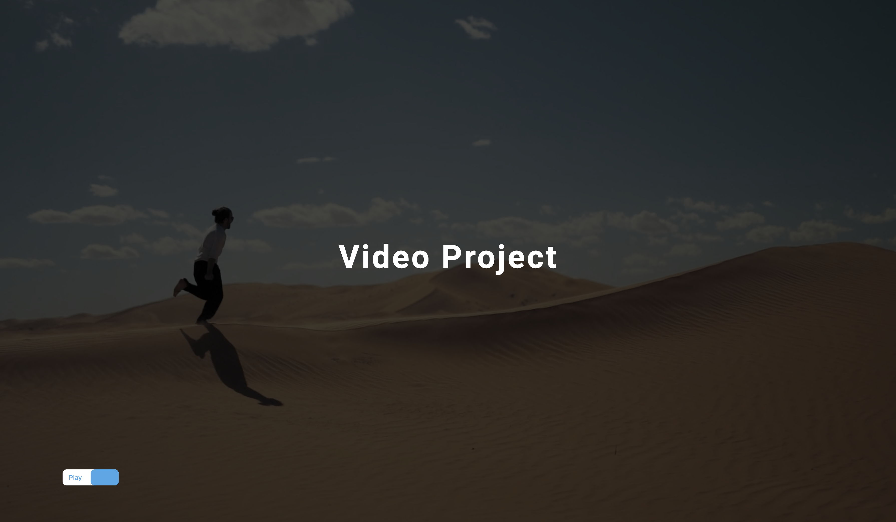
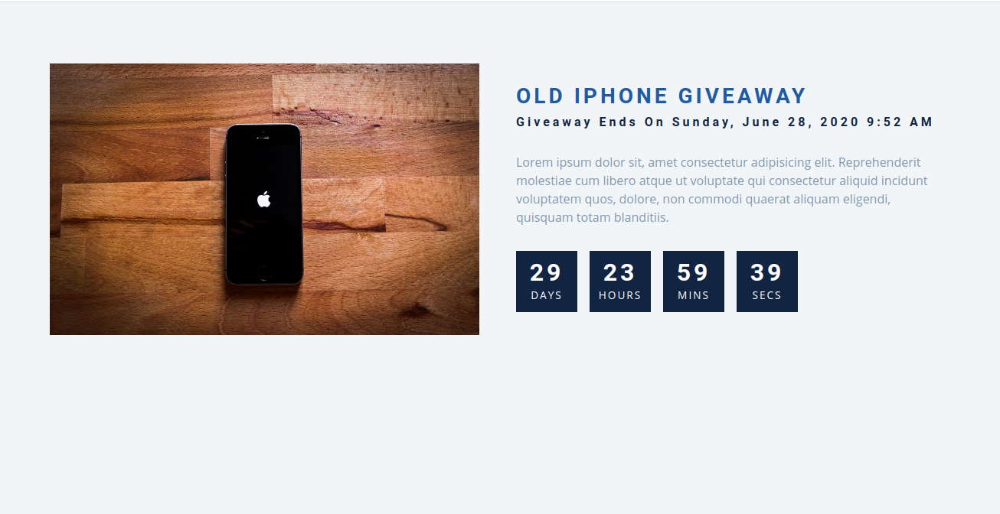
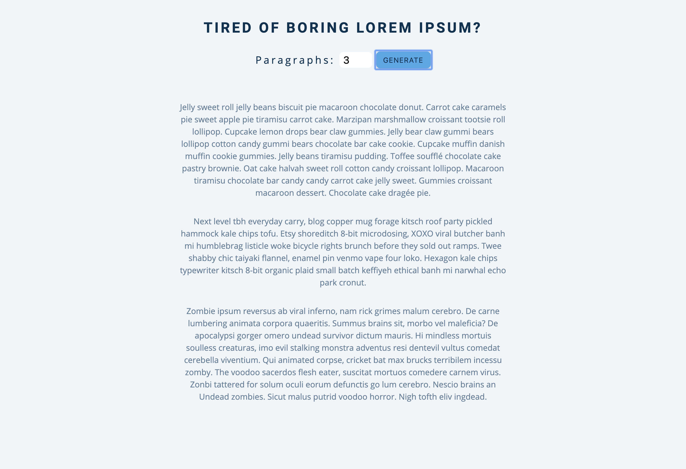

# react-sample-projects

React Sample Projects

## Found this project useful?

If you found this project useful, then please consider giving it a ⭐️ on Github and sharing it with your friends via social media.

## Examples

1. [Color Flipper](./color-flipper)
1. [Counter](./counter)
1. [Reviews](./reviews)
1. [Navbar](./navbar)
1. [Sidebar](./sidebar)
1. [Modal](./modal)
1. [Questions](./questions)
1. [Menu](./menu)
1. [Video](./video)
1. [Scroll](./scroll)
1. [Tabs](./tabs)
1. [Countdown Timer](./countdown-timer)
1. [Lorem Ipsum](./lorem-ipsum)
1. [Todo](./todo)
1. [Slider](./slider)

## demo

| Name          | Preview                                                                            | Source                           |
| ------------- | ---------------------------------------------------------------------------------- | -------------------------------- |
| Color Flipper |  | [Color Flipper](./color-flipper) |
| Counter       |               | [Counter](./counter)             |
| Reviews       |               | [Reviews](./reviews)             |
| Navbar        |                 | [Navbar](./navbar)               |
| Sidebar       |               | [Sidebar](./sidebar)             |
| Modal         |                   | [Modal](./modal)                 |
| Questions     |           | [Questions](./questions)         |
| Menu          |                    | [Menu](./menu)                   |
| Video         |                  | [Video](./video)                 |
| Countdown Timer         |                  | [Countdown Timer](./countdown-timer)                 |
| Lorem ipsum   |            | [Lorem Ipsum](./lorem-ipsum)     |
| Slider         |                | [Slider](./slider)               |

## TODO

    - Improve Docs

## Contributing

Awesome! Contributions of all kinds are greatly appreciated. To help smoothen the process we have a few non-exhaustive guidelines to follow which should get you going in no time.

## Using GitHub Issues

1. Feel free to use GitHub [issues](https://github.com/curioustushar/react-sample-projects/issues) for questions, bug reports, and feature requests
2. Use the search feature to check for an existing issue Include as much information as possible and provide any relevant resources (Eg. screenshots)

## Created & Maintained By

Tushar Gupta | [@curioustushar](https://twitter.com/curioustushar)

Feel free to reach out to me through [@curioustushar](https://twitter.com/curioustushar) if you have any questions or feedback! 😊

## Thanks & Credits

Idea / Concepts is take from [javascript-basic-projects](https://github.com/john-smilga/javascript-basic-projects).
